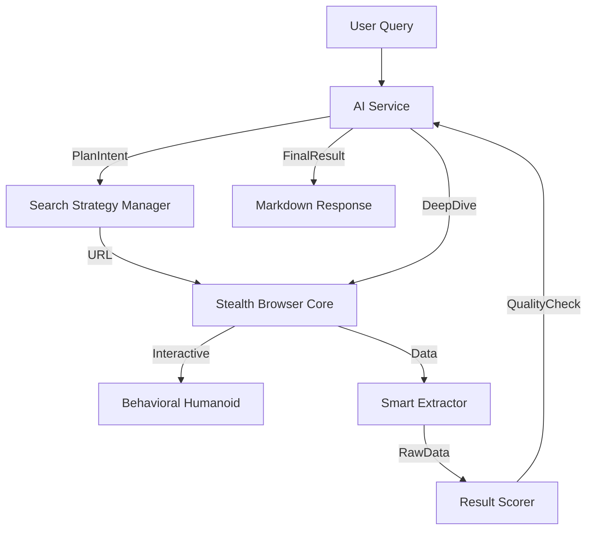

# Stealth Browser Pro: Autonomous AI Scraping Engine 🧠🕵️‍♂️

A next-generation, high-performance web automation and data extraction engine powered by AI. **Stealth Browser Pro** combines advanced bot-bypass techniques with an autonomous reasoning loop to handle complex research tasks with human-like precision.

## 🚀 Key Features

### 1. Autonomous AI Intent Detection
Powered by `AIService`, the system doesn't rely on hardcoded rules. It semantically analyzes your query to:
- **Determine Intent**: Decides whether to answer directly or search the web.
- **Formulate Strategy**: Chooses the best specialized tool (GSMArena, YouTube, GitHub, etc.) autonomously.
- **Deep-Dive Navigation**: Automatically follows search results to extract page-level details if the initial landing page is insufficient.

### 2. Hardcore Stealth & Bot Bypass
- **CDP Masking**: Sophisticated masking of `navigator.webdriver` and browser fingerprints via `FingerprintManager`.
- **Humanoid Behavior**: Realistic mouse movements, typing, and random scrolling patterns.
- **Cookie Rotation**: Seamless switching between multiple cookie profiles to bypass rate limiting.
- **System Browser Integration**: Option to launch your installed Chrome instance for maximum credibility.

### 3. Precision Extraction Tools
Dedicated extractors for:
- 📱 **GSMArena**: Full device specifications and comparisons.
- 🌤️ **AccuWeather**: Real-time forecasts and climate data.
- 📺 **YouTube**: Channel discoveries and video summaries.
- 🛠️ **GitHub/NPM**: Repository metadata and package info.
- 📰 **Bing**: Global search results with localized (English) enforcement.

---

## 🛠️ Performance Benchmarks

| Domain | Action | Avg Speed | Accuracy |
| :--- | :--- | :--- | :--- |
| **Simple QA** | LLM Direct Answer | ~5s | 100% |
| **Specialized Search** | Direct Site Navigation | 30s - 60s | 98% |
| **Deep Research** | Multi-Step Interaction | 90s - 150s | 95% |

---

## 💻 Usage

### 🎨 AI Mode (Recommended)
Let the agent figure out the best way to get the data:
```bash
node src/cli.js --ai "Compare iPhone 15 vs Samsung S24" --system --headed
```

### 🧹 Cache Control
Force a fresh autonomous plan (bypasses previously cached intent):
```bash
node src/cli.js --ai "Latest tech news" --clear-cache
```

### ⚡ Direct Extraction
Scrape a specific URL without AI intervention:
```bash
node src/cli.js --url "https://news.ycombinator.com" --extract
```

---

## 🏗️ Architecture



## 📦 Requirements
- Node.js v18+
- Puppeteer & Puppeteer-Extra
- Stealth Plugin, Anonymize UA, and User Preferences plugins.

## 🤝 Contributing
Feel free to open issues or PRs for new domain-specific extractors!

---
**Disclaimer**: Use this tool responsibly and in accordance with the target websites' Terms of Service.